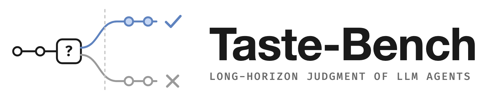
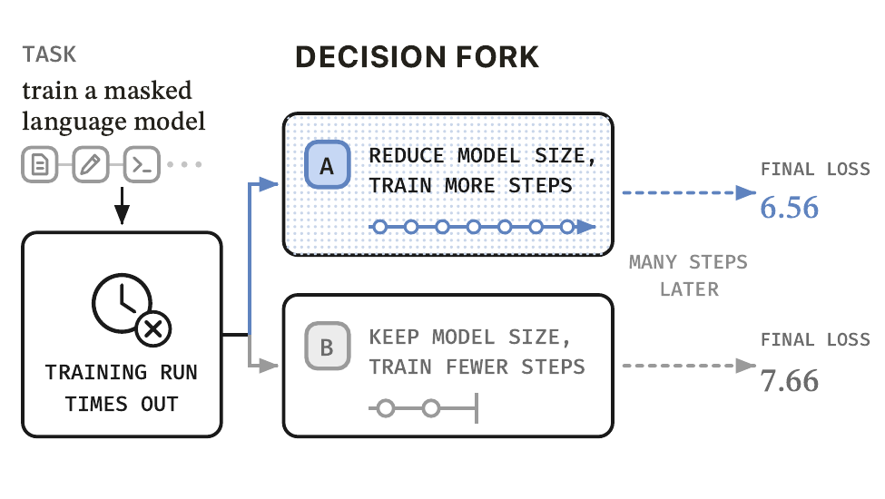

<div align="center">

<picture>
  <source media="(prefers-color-scheme: dark)" srcset="assets/logo_dark.png">
  
</picture>

<br>

📄 [Paper](#citation) &nbsp;|&nbsp; 🤗 [Dataset](https://huggingface.co/datasets/wenbopan/taste-bench) &nbsp;|&nbsp; 🏆 [Leaderboard](#leaderboard) &nbsp;|&nbsp; 🚀 [Quick start](#quick-start)

[](https://huggingface.co/datasets/wenbopan/taste-bench) [](https://github.com/wbopan/tastebench/actions/workflows/ci.yml) [](pyproject.toml) [](LICENSE)

</div>

---

**Taste-Bench measures the *taste* of an LLM agent: its ability to choose the better direction at a real decision fork in a long-horizon task.** Given the *task*, the *trajectory up to the fork*, and *two candidate next steps*, the model must pick the step that the hidden rest of the trajectory proves right. A wrong choice often looks reasonable at the moment and costs the agent most of its budget later. The 502 questions are mined from software engineering and machine-learning research trajectories, with no expert annotation, and the best frontier model answers **59.7%** of them correctly.

<div align="center">

<br>
<sub>A decision fork from a machine-learning trajectory. The model chooses before the later losses reveal that A is better.</sub>
</div>

## Leaderboard

A question counts as correct only when the model answers it correctly in **both** option orders, so random guessing scores 25 and a model that always picks the same position scores 0. **Average** is the 1:1 mean of the research and engineering subsets.

| Model | Average | D-Eng | D-Res | P-Eng | P-Res | Unparsed |
|---|---:|---:|---:|---:|---:|---:|
| GPT-5.6 Sol | 59.7 | 48.1 | 67.2 | 75.8 | 56.2 | 0 |
| GPT-5.5 | 59.5 | 47.4 | 68.8 | 73.4 | 56.2 | 0 |
| Claude Opus 5 | 55.5 | 35.3 | 64.1 | 71.0 | 64.6 | 0 |
| Grok 4.5 | 54.6 | 47.7 | 57.8 | 61.3 | 56.2 | 10 |
| GPT-5.6 Terra | 54.0 | 40.6 | 57.8 | 70.2 | 58.3 | 0 |
| GLM-5.2 | 53.9 | 40.2 | 59.4 | 64.5 | 60.4 | 17 |
| Claude Sonnet 5 | 51.6 | 36.1 | 60.9 | 62.1 | 56.2 | 0 |
| GPT-5.6 Luna | 49.0 | 32.3 | 57.8 | 67.7 | 50.0 | 0 |
| MiniMax M3 | 45.3 | 34.6 | 39.1 | 64.5 | 56.2 | 3 |
| DeepSeek V4 Flash | 43.3 | 29.3 | 46.9 | 58.1 | 50.0 | 2 |
| GPT-5.4 Mini | 40.1 | 25.2 | 54.7 | 26.6 | 54.2 | 112 |
| Mistral Medium 3.5 | 37.7 | 40.6 | 28.1 | 43.5 | 41.7 | 24 |
| GPT-5.4 Nano | 36.6 | 25.6 | 39.1 | 46.0 | 43.8 | 93 |
| Grok 4.20 Reasoning | 15.7 | 19.9 | 9.4 | 28.2 | 8.3 | 459 |

<sub>D = detour, P = parallel; Eng = engineering (390 questions), Res = research (112). Unparsed presentations, out of 1,004, count as wrong. All rows use protocol <code>paired_order_v1</code>, August 2026. To add a model, run the full protocol and open a pull request with its <code>summary.json</code> under <code>results/&lt;model&gt;/</code>.</sub>

## How the questions are built

The later part of a trajectory is hindsight evidence for the decision made at a fork, so the trajectories label themselves. Questions come in two constructions and two domains.

- **Parallel forks.** Independent attempts at the same task diverge at the same point and end with different recorded outcomes. The outcome of each attempt labels the better direction.
- **Detour forks.** An agent takes a direction, abandons it after an observed failure, and recovers inside the same run. The abandoned direction and the later recovery are the candidates.
- **Filtering.** A question is dropped as *trivial* when every judge model answers it from the candidate wording alone, and as *undecidable* when any judge disagrees with its label after reading the full record. Of 4,657 mined forks, 502 survive: 266 detour and 124 parallel questions in engineering (SWE-bench and SWE-bench Pro rollouts), 64 detour and 48 parallel in research (METR's MALT release of RE-Bench and HCAST runs).

<details>
<summary><b>Example question</b> (parallel, engineering)</summary>
<br>

> **Task.** Modify NodeBB production source code so the admin file-upload endpoint validates the requested folder before saving. Resolve the folder using the configured `nconf.get('upload_path')` as its base, reject missing or non-directory targets with `[[error:invalid-path]]`, and prevent paths from escaping the upload root.
>
> **Progress.** 30 recorded steps: the agent has inspected the harness, found the admin upload controller and its tests, and read the surrounding file helpers.
>
> **A.** Add a focused folder-existence helper that resolves the target under the configured upload root and verifies it is a directory. Before calling the save helper, reject invalid targets with `[[error:invalid-path]]` and delete the temporary uploaded file.
>
> **B.** Inline upload-root containment and directory-stat checks inside the controller's existing save try/catch. Throw `[[error:invalid-path]]` for invalid targets and let the existing catch forward the error through `next`.

Hidden from the model: **A** is correct. The attempt that took A passed the hidden tests; B forwarded the error without cleaning up the temporary upload, and its attempt failed.

</details>

## Evaluation protocol

Specified in [`protocol/paired_order_v1.yaml`](protocol/paired_order_v1.yaml). The model sees the task, the full pre-decision trajectory as published in `prefix_text` (credentials and usernames redacted, 64K-token budget with an explicit omission marker on overflow), and the two candidates. The prompt asks for one line, `ANSWER: X`, without visible chain of thought. Every question is asked in the published option order and in its exact reverse, with letters recomputed each time. The denominator is every released question, and request errors and unparseable outputs count as wrong. `tb validate` checks the release hashes and every question's invariants.

## Quick start

The dataset is gated to limit training contamination: request access on its [Hugging Face page](https://huggingface.co/datasets/wenbopan/taste-bench), then run `hf auth login` once.

```bash
git clone https://github.com/wbopan/tastebench && cd tastebench && uv sync
uv run tb download                                   # wenbopan/taste-bench@v1.0 into ./data
export TASTEBENCH_API_KEY=...                        # any OpenAI-compatible endpoint
uv run tb run --model gpt-5.5 --api https://api.openai.com/v1/chat/completions
uv run tb score runs/gpt-5.5/<date>                  # prints per-cell accuracy and Average
```

`tb run` writes one record per question and order, is resumable, and takes `--limit N` for smoke tests. A full run is 1,004 requests and about 8M input tokens. Per-model request settings live in [`configs/models.yaml`](configs/models.yaml).

The data itself is two parquet configs, `engineering` (390 rows) and `research` (112 rows), with one `test` split each. A row holds `query`, the full `prefix_text`, the two `choices` in the published order, and the `answer` letter, plus `cell`, `task_id`, and a contamination canary. It loads without this repository:

```python
from datasets import load_dataset
rows = load_dataset("wenbopan/taste-bench", "engineering", split="test", revision="v1.0")
```

## Citation

```bibtex
@inproceedings{tastebench2026,
  title     = {The Tasteful Agent: Measuring and Improving Taste in Long-Horizon Tasks},
  author    = {},
  booktitle = {},
  year      = {2026}
}
```

Trajectories come from SWE-bench, SWE-bench Pro, and METR's MALT release. The code is released under the [MIT License](LICENSE) and the dataset text under CC BY 4.0.
