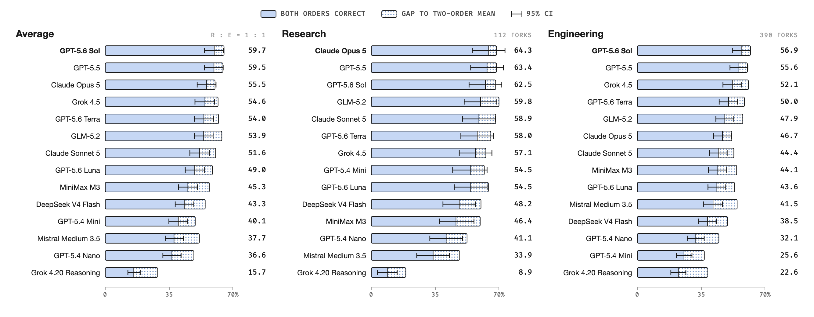
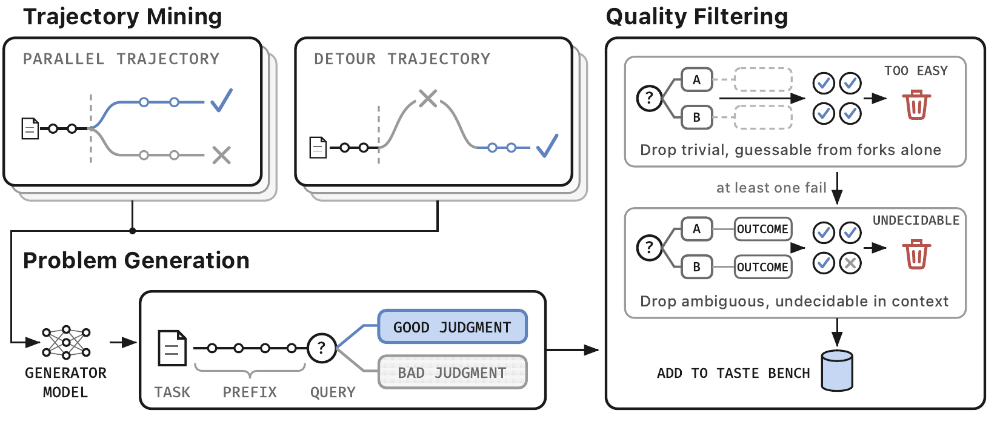

<div align="center">

<picture>
  <source media="(prefers-color-scheme: dark)" srcset="assets/logo_dark.png">
  
</picture>

<br>

📄 [Paper](#citation) &nbsp;|&nbsp; 🤗 [Dataset](https://huggingface.co/datasets/wbopan/tastebench) &nbsp;|&nbsp; 🏆 [Leaderboard](#leaderboard) &nbsp;|&nbsp; 🚀 [Quick start](#quick-start)

[](https://huggingface.co/datasets/wbopan/tastebench) [](https://github.com/wbopan/tastebench/actions/workflows/ci.yml) [](pyproject.toml) [](LICENSE)

</div>

---

**Taste-Bench measures the *taste* of an LLM agent: its ability to choose the better direction at a real decision fork in a long-horizon task.** Given the *task*, the *trajectory up to the fork*, and *two candidate next steps*, the model must pick the step that the hidden rest of the trajectory proves right. The 502 questions are mined from software engineering and machine-learning research trajectories, with no expert annotation.

<div align="center">

<br>
<sub>A decision fork from a machine-learning trajectory. The model chooses before the later losses reveal that A is better.</sub>
</div>

<br>

Why this matters: a wrong long-horizon decision often looks reasonable at the moment, and its cost appears only after the agent has spent most of its budget. End-to-end benchmarks report whether the agent finished, not whether it decided well along the way. Taste-Bench measures the decisions themselves, and the best frontier model gets **59.7%** of them right.

## News

- **[2026-09]** Initial release: 502 questions, the paired-order evaluation protocol, and results for 14 frontier models.

## Leaderboard

Accuracy is the share of questions answered correctly in **both** option orders, so random guessing scores 25 and a model that always picks the same position scores 0. **Average** is the 1:1 mean of the research and engineering subsets.

<div align="center">

</div>

| Model | Average | D-Eng | D-Res | P-Eng | P-Res | Unparsed |
|---|---:|---:|---:|---:|---:|---:|
| GPT-5.6 Sol | 59.7 | 48.1 | 67.2 | 75.8 | 56.2 | 0 |
| GPT-5.5 | 59.5 | 47.4 | 68.8 | 73.4 | 56.2 | 0 |
| Claude Opus 5 | 55.5 | 35.3 | 64.1 | 71.0 | 64.6 | 0 |
| Grok 4.5 | 54.6 | 47.7 | 57.8 | 61.3 | 56.2 | 10 |
| GPT-5.6 Terra | 54.0 | 40.6 | 57.8 | 70.2 | 58.3 | 0 |
| GLM-5.2 | 53.9 | 40.2 | 59.4 | 64.5 | 60.4 | 17 |
| Claude Sonnet 5 | 51.6 | 36.1 | 60.9 | 62.1 | 56.2 | 0 |
| GPT-5.6 Luna | 49.0 | 32.3 | 57.8 | 67.7 | 50.0 | 0 |
| MiniMax M3 | 45.3 | 34.6 | 39.1 | 64.5 | 56.2 | 3 |
| DeepSeek V4 Flash | 43.3 | 29.3 | 46.9 | 58.1 | 50.0 | 2 |
| GPT-5.4 Mini | 40.1 | 25.2 | 54.7 | 26.6 | 54.2 | 112 |
| Mistral Medium 3.5 | 37.7 | 40.6 | 28.1 | 43.5 | 41.7 | 24 |
| GPT-5.4 Nano | 36.6 | 25.6 | 39.1 | 46.0 | 43.8 | 93 |
| Grok 4.20 Reasoning | 15.7 | 19.9 | 9.4 | 28.2 | 8.3 | 459 |

<sub>D = detour, P = parallel; Eng = engineering (390 questions), Res = research (112). Unparsed counts presentations, out of 1,004, whose final answer could not be read; they count as wrong. Every model answered under the same prompt, the same 64K-token input budget, and the same seeded and reversed orders. Per-model summaries are in <code>results/</code>; <code>tb leaderboard</code> regenerates this table.</sub>

> [!NOTE]
> All rows were produced with protocol `paired_order_v1` in August 2026. To add a model, run the same protocol over all 502 questions in both orders and open a pull request with the run's `summary.json` under `results/<model>/`. Partial runs and other prompts are not comparable.

## How the questions are built

A *decision fork* is a point where attempts at the same task diverge. The later part of the trajectory is hindsight evidence for the decision made at the fork, so the trajectories label themselves.

<div align="center">

</div>

- **Parallel forks.** Independent attempts at the same task diverge at the same point and end with different recorded outcomes. The shared part before the fork becomes the prefix, the two directions become the candidates, and the outcome of each attempt labels the better one.
- **Detour forks.** An agent takes a direction, abandons it after an observed failure, and recovers inside the same run. The fork is placed right before the abandoned direction. The abandoned direction and the later recovery become the candidates.
- **Filtering.** A candidate question is dropped as *trivial* when every judge model answers it from the candidate wording alone, and as *undecidable* when any judge disagrees with its label after reading the full record. Of 4,657 mined forks, 502 survive.

| | Engineering | Research |
|---|---:|---:|
| **Detour** | 266 | 64 |
| **Parallel** | 124 | 48 |

Engineering questions come from graded rollouts on SWE-bench and SWE-bench Pro tasks. Research questions come from MALT, the public transcript release of METR, on RE-Bench and HCAST tasks. The mining pipeline is not part of this repository; the released questions are the product.

## Example question

<table>
<tr><td>

**Task given to the agent**

> Modify NodeBB production source code so the admin file-upload endpoint validates the requested folder before saving. Resolve the folder using the configured `nconf.get('upload_path')` as its base, reject missing or non-directory targets with `[[error:invalid-path]]`, and prevent paths from escaping the upload root. Do not introduce new interfaces or add/edit tests.

**Agent's progress so far** — 30 recorded steps, shown in full to the model: the agent has inspected the harness, found the admin upload controller and its tests, and read the surrounding file helpers.

**Decision point**

**A.** Add a focused folder-existence helper for the admin upload controller that resolves the target under the configured upload root and verifies it is a directory. Before calling the save helper, reject invalid targets with `[[error:invalid-path]]` and delete the temporary uploaded file.

**B.** Inline upload-root containment and directory-stat checks inside the controller's existing save try/catch. Throw `[[error:invalid-path]]` for invalid targets and let the existing catch forward the error through `next`.

<details>
<summary><b>Hidden from the model: label and rationale</b></summary>
<br>

**A** is correct. The attempt that took A passed the hidden tests; the attempt that took B failed them. The two branches differ on a resource-lifecycle decision: A validates before saving and deletes the temporary multipart file on rejection, while B forwards the error through the existing catch path without cleaning up the upload.

</details>

</td></tr>
</table>

## Evaluation protocol

The protocol is specified in [`protocol/paired_order_v1.yaml`](protocol/paired_order_v1.yaml) and explained in [`protocol/paired_order_v1.md`](protocol/paired_order_v1.md).

1. **Input.** The model sees the task, the full trajectory prefix up to the fork, and the two candidates. The prefix is rebuilt from the released transcript, and credential-shaped text is redacted before it is hashed or sent. When a request exceeds 65,536 tokens, the first 25 rendered lines and the longest possible tail are kept, with an explicit omission marker.
2. **Prompt.** The prompt states that exactly one candidate is better and asks for one line, `ANSWER: X`. It does not request visible chain of thought. Provider-native reasoning settings belong to the per-model config.
3. **Two orders.** Every question is asked twice, once in a seeded option order and once in the exact reverse. The letters are recomputed after each ordering, so an answer that flips with the order does not count.
4. **Scoring.** The denominator is every released question. Request errors and unparseable outputs count as wrong. We report the both-orders accuracy, the mean single-order accuracy, the four paired outcomes (CC, CW, WC, WW), and position-choice counts, overall and per cell.

Only `query`, the rendered prefix, and the text of each choice reach the evaluated model. The rationale, the outcomes, and the provenance fields never do, and `tb validate` checks that boundary.

## Quick start

```bash
git clone https://github.com/wbopan/tastebench && cd tastebench
uv sync
uv run tb download        # fetch the release from Hugging Face into ./data
uv run tb validate        # check the 502 questions and the transcript hashes
```

Point `tb run` at any OpenAI-compatible `chat/completions` or `responses` URL. The key is read from `TASTEBENCH_API_KEY`.

```bash
export TASTEBENCH_API_KEY=...
uv run tb run --model gpt-5.5 --api https://api.openai.com/v1/chat/completions
uv run tb score runs/gpt-5.5/<date>
```

`tb score` prints the headline numbers:

```text
items 502  seeded 317/502  reversed 321/502  both_correct 292 (58.2%)  errors 0  unparsed 0
  detour_engineering     both_correct 128/266 (48.1%)
  detour_research        both_correct 43/64 (67.2%)
  parallel_engineering   both_correct 94/124 (75.8%)
  parallel_research      both_correct 27/48 (56.2%)
Average 59.7
```

`tb run` writes one JSON record per question and order under `runs/<model>/<date>/raw/`, plus `summary.json` and a `manifest.json` with the hashes of the config, the protocol, and the release. Runs are resumable, and `--limit N` runs a smoke test on the first N questions. Per-model request settings such as temperature, reasoning effort, and token limits live in [`configs/models.yaml`](configs/models.yaml).

> [!TIP]
> A full run is 1,004 requests and about 8M input tokens. The median prompt is 7K tokens and the longest is 54K. Reasoning output varies from under 0.1M to 7M tokens across the models above.

## Data

The release on Hugging Face has the same layout that the code reads locally:

```text
manifest.json                  item counts and SHA-256 of every file below
items/<cell>.jsonl             one question per line, four cells
transcripts.manifest.json      step counts and checksums of every transcript
transcripts/<traj_id>.json     the recorded trajectories the prefixes are rebuilt from
```

<details>
<summary><b>Fields of a question</b></summary>
<br>

| Field | Meaning |
|---|---|
| `id`, `method`, `dataset`, `task_id` | Identity: `method` is `parallel` or `detour`; `dataset` is the trajectory source |
| `query` | The task given to the agent |
| `reference_traj`, `breakpoint_step` | The transcript and the step at which it is frozen |
| `prefix_text` | The rendered prefix up to the fork |
| `choices[].text` | The two candidate next steps |
| `choices[].is_correct` | The label from the recorded outcome |
| `choices[].outcome` | The recorded outcome of the branch |
| `rationale` | Why the label holds, hidden from the model |
| `quality`, `provenance` | Filter votes and extraction metadata, hidden from the model |

</details>

## Citation

```bibtex
@inproceedings{tastebench2026,
  title     = {The Tasteful Agent: Measuring and Improving Taste in Long-Horizon Tasks},
  author    = {},
  booktitle = {},
  year      = {2026}
}
```

## Acknowledgements

The trajectories come from SWE-bench, SWE-bench Pro, and the MALT release of METR, which covers RE-Bench and HCAST tasks. The transcripts are technical agent records, not human-subject data, and credential strings are removed before any hashing or transmission.

Released under the [MIT License](LICENSE).
